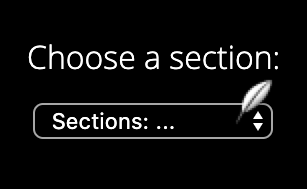

# InstaNews

Responsive Mobile-First News App Using The New York Times API <br>


## Preview

Clone repository<br>

run in local server of your choice<br>

## Technologies used
* HTML5
* CSS3
* [SASS](https://sass-lang.com/)
* [JQuery](https://jquery.com/)
* [JSON]("https://www.json.org/)
* [v2 NYT API](https://developer.nytimes.com/)
* [GULP]("https://gulpjs.com/docs/en/getting-started/quick-start") 
* Git
* bash

## Media Querys

* Mobile: 320 x 568
* Tablet: 768 x 1024
* Desktop: 1240 x 1015

## Personal Learnings

### SASS:
This was the first time I was introduced to the stylesheet language SASS. I used SASS variables, nested rules, and mixins to create a more symantic readable stylesheet.

Example:<br>

```$font-family: 'Open-Sans-Light';```

```
@mixin tablet{
    @media (min-width: 768px){
        @content;
    }
}
```
```
header{
    @include tablet{
        // media query here 
    }
}
```

### JSON:
I was introduced to JSON(JavaScript Object Notation) a lightweight data-interchange format. Linked to the New York Times API(v2 NYT API), I was able to return real time data and format it accordingly into my webpage.

Example:<br>

```javascript
$.getJSON("path/to/(v2 NYT API)/mykey")
.done(function(data)){
    // Use data here
}
```

### GULP Task-runner
I learnt how to utilise task-runner [GULP]("https://gulpjs.com/docs/en/getting-started/quick-start") to Automate and streamline my work flow.
I created a ```gulp.js``` file that streamlines my SASS into pure CSS3, minifies my ```app.js``` and ```style.css```, then places them in a build directory, live using browser-sync.<br>

Example:<br>

```javascript
gulp.task("sass", function(){
    return gulp
    ...
}
```

```javascript
gulp.task("scripts", function(){
    return gulp
    ...
}
```

``` javascript
gulp.task("browser-sync", function(done){
    return gulp
    ...
}
```

## Custom menu



To add some personal flavour to my page I implemented a [custom cursor](http://www.rw-designer.com/cursor-library), and matched the colour pallet to that of the site.


<br>


## Environment
* macOS Mojave: 10.14.6
* VS Code: 1.39.1

## Contributing

Please feel free to clone this project, feedback and improvements welcome.

## Authors
* **Bruce Pouncey** - *Initial work* - [BPouncey](https://github.com/BPouncey)

## License
(MIT)

## Acknowledgments
[RED Academy](https://github.com/redacademy)


